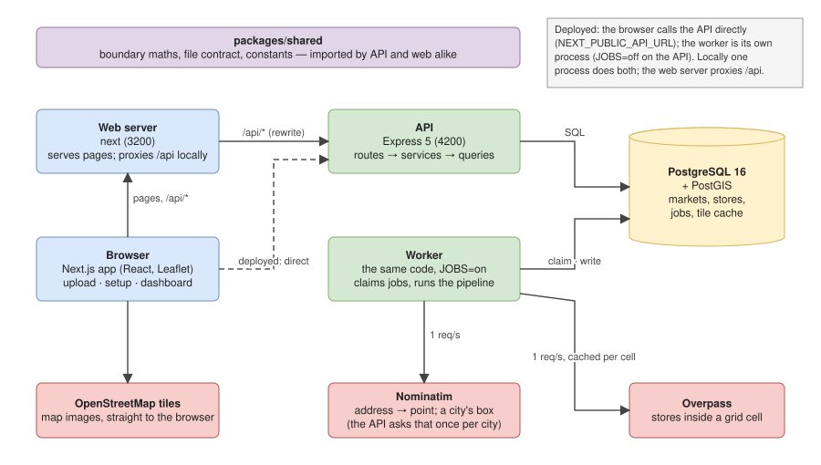
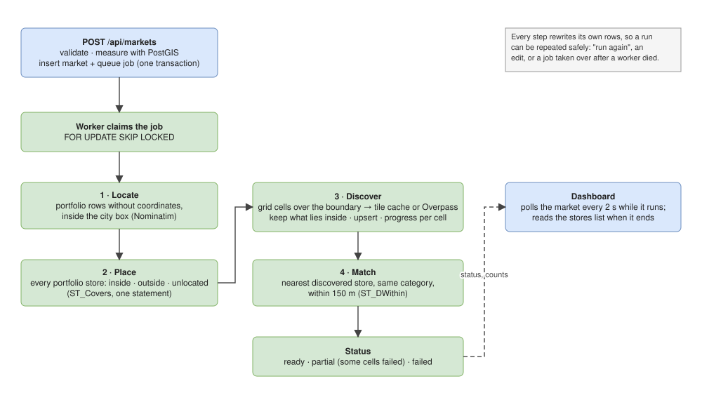

# Architecture

Three runnable pieces and one database, with the outside world behind interfaces. Every diagram here is also an editable
draw.io file in [`diagrams/`](diagrams/); open the `.drawio` in [diagrams.net](https://app.diagrams.net) to change it and
regenerate the SVG.

## The system

**Reading the diagram.** The browser loads the app from the web server and, locally, calls `/api/*` on the same origin,
which the web server forwards to the API (1). The API answers reads and writes from PostgreSQL (2). A create queues a job
in the same database; the worker claims it and runs the pipeline (3), asking Nominatim for addresses and Overpass for
stores at one request per second each, with every answered grid cell cached (4). Map tiles go straight from
OpenStreetMap to the browser; the city's own box is asked of Nominatim once per city. Deployed, the dashed line is the
real path: the browser calls the API's domain directly and the web server only serves pages.

- **Web** (`apps/web`): Next.js App Router, React Query for server state, Leaflet for maps, Tailwind tokens for light and
  dark. Three screens follow the design's stepper: upload, setup, dashboard. Locally the web server proxies `/api/*` to
  the API so the browser sees one origin; deployed, `NEXT_PUBLIC_API_URL` points the browser at the API directly and the
  web tier serves pages only.
- **API** (`apps/api`): Express 5. Routes validate shape with zod and hand off; services hold the rules; queries hold the
  SQL. The OpenAPI document is generated from the same zod schemas and served at `/api/docs`.
- **Worker**: the same code with `JOBS=on`, polling an in-database queue. Locally the API process runs it too; deployed
  it is its own process.
- **PostgreSQL + PostGIS**: boundaries are polygons, points are geography, so area, containment and distance are measured
  in metres by the database.
- **`packages/shared`**: pure TypeScript both sides import: boundary maths, the portfolio file contract, constants such
  as the area cap and the match distance, so the screen's numbers and the server's rules cannot drift.

## A market's run

**Reading the diagram.** Top left, the request: validate, measure, insert the market and its job in one transaction,
answer `201` with the market queued. Down the left column, the worker's claim and the first two steps, which need only
the portfolio: locate what came without coordinates, place everything against the rectangle. Then the right column:
discovery over the grid cells, matching against what was found, and the status. The dashboard on the right never talks
to the worker; it polls the market and reads the stores list, so the finished market is whatever the database says.

Creating a market inserts the row and its job in one transaction. The worker claims the job with `FOR UPDATE SKIP LOCKED`,
so several workers can share the queue, and runs four steps in order: locate, place, discover, match. Discovery covers the
rectangle with fixed grid cells, answers each from the tile cache when it can, keeps only what lies inside the boundary,
and records progress per cell, so the dashboard can say "4 of 9 areas". A cell that fails after its retries does not fail
the market: the run ends `partial` with the cells named.

Every step rewrites its own rows, which is what makes "run again", an edit, and recovery after a crashed worker all the
same operation: queue the job once more.

## Data model

**Reading the diagram.** `markets`, top centre, is what everything else belongs to: it points at the portfolio it was
made from and the city it is in; `discovered_stores` to its right, `market_portfolio_stores` below, `market_categories`
and the `jobs` row queued for it all point back at it and go with it when it is deleted. `market_portfolio_stores` joins
a market to a `portfolio_stores` row and carries the placement and, when found, the discovered store it was matched to,
cleared rather than broken when that store goes. The location tree runs down the left. `place_tiles`, bottom right,
belongs to no market: it is the discovery cache and outlives the markets that filled it. Every column is listed in
[DATABASE.md](DATABASE.md), which also carries the schema as DBML for dbdiagram.io.

| Table | Holds | Notes |
|---|---|---|
| `countries`, `states`, `cities` | the seeded location tree | a city caches its bounding box after the first lookup |
| `categories` | the seeded categories | each maps to OpenStreetMap tag selectors |
| `portfolios`, `portfolio_stores` | an upload and its rows | a store keeps where its point came from: uploaded or geocoded |
| `markets`, `market_categories` | a market's decisions and its run state | boundary as a PostGIS polygon; status, error, progress |
| `discovered_stores` | what discovery found for a market | unique per market and provider id, so a re-run updates in place |
| `market_portfolio_stores` | each portfolio store's placement for a market, and its match | inside, outside or unlocated; the matched store and the distance |
| `place_tiles` | the discovery cache | keyed by provider, grid cell and category set; expires by age |
| `jobs` | the queue | type, payload, attempts, retry time, last error; cascades with its market |

Everything hangs off `markets` with `ON DELETE CASCADE`, so deleting a market is one statement. Every column, with the
links drawn, is in [DATABASE.md](DATABASE.md); the same schema is in [`diagrams/schema.dbml`](diagrams/schema.dbml) for
dbdiagram.io.

## Providers

Address lookup and store discovery sit behind two interfaces, `Geocoder` and `PlacesProvider`, each a factory function.
Today's implementations are Nominatim and Overpass, with a fixture twin of each that answers from JSON files for tests and
offline use. The setup screen lists every provider with its availability, so a Google option shows as "not configured"
until a key is set. All outbound calls go through one HTTP client that throttles to the mirrors' one request per second,
identifies itself, times out and retries.

## Conventions

- Layers: routes, services (only where there is a rule), queries with the SQL. Providers behind interfaces.
- Functions and plain objects, no classes. A header comment on every file saying what it is for.
- Every file with logic has a test beside it; screens are tested with React Testing Library on Jest, the API with
  `node:test` against a real database.
- Screens speak the user's words, never the system's; a control appears when its action is possible.
- Packages over hand-rolled utilities.

The high-level design, including how this shape changes at a million and ten million users, is in
[design/HLD.md](design/HLD.md); the modules, contracts, sequences and SQL are in [design/LLD.md](design/LLD.md). The
reasoning behind each scaling decision, with the alternatives weighed, is in [PRODUCTION.md](PRODUCTION.md).
