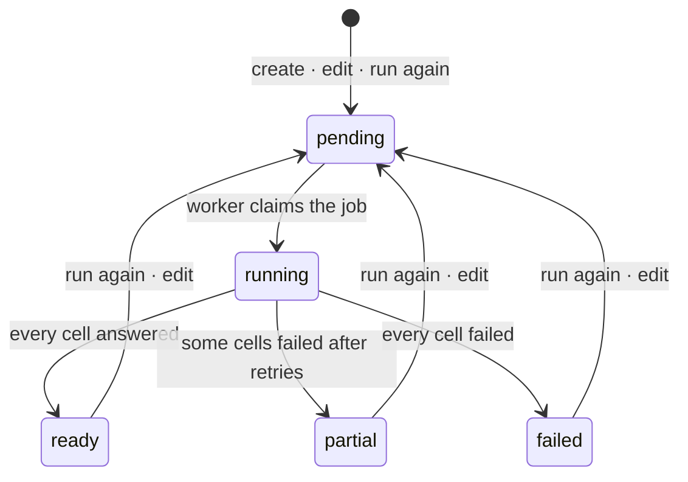

# Architecture

Three runnable pieces and one database, with the outside world behind interfaces. Every diagram here is also an editable
draw.io file in [`diagrams/`](diagrams/); open the `.drawio` in [diagrams.net](https://app.diagrams.net) to change it and
regenerate the SVG.

## The system


**Reading the diagram.** The browser loads the app from the web server and, locally, calls `/api/*` on the same origin,
which the web server forwards to the API (1). The API answers reads and writes from PostgreSQL (2). A create queues a job
in the same database; the worker claims it and runs the pipeline (3), asking Nominatim for addresses and Overpass for
stores at one request per second each, with every answered grid cell cached (4). Map tiles go straight from
OpenStreetMap to the browser; the city's own box is asked of Nominatim once per city. Deployed, the dashed line is the
real path: the browser calls the API's domain directly and the web server only serves pages.

- **Web** (`apps/web`): Next.js App Router, React Query for server state, Leaflet for maps, Tailwind tokens for light and
  dark. Three screens follow the design's stepper: upload, setup, dashboard. Locally the web server proxies `/api/*` to
  the API so the browser sees one origin; deployed, `NEXT_PUBLIC_API_URL` points the browser at the API directly and the
  web tier serves pages only.
- **API** (`apps/api`): Express 5. Routes validate shape with zod and hand off; services hold the rules; queries hold the
  SQL. The OpenAPI document is generated from the same zod schemas and served at `/api/docs`.
- **Worker**: the same code with `JOBS=on`, polling an in-database queue. Locally the API process runs it too; deployed
  it is its own process.
- **PostgreSQL + PostGIS**: boundaries are polygons, points are geography, so area, containment and distance are measured
  in metres by the database.
- **`packages/shared`**: pure TypeScript both sides import: boundary maths, the portfolio file contract, constants such
  as the area cap and the match distance, so the screen's numbers and the server's rules cannot drift.

## Where the code lives

| Path | Responsibility |
|---|---|
| `packages/shared/src/geo.ts` | boundary maths: area, dimensions, grid cells, containment, the area cap, the default market, the match distance |
| `packages/shared/src/portfolio.ts` | the file contract: required and optional headers, row validation, the issue shape |
| `apps/api/src/config.ts` | one zod schema for every variable; the process fails at start-up with the variable named |
| `apps/api/src/app.ts` | the Express app: helmet, compression, CORS, rate limit, request log, routes, OpenAPI, the error handler, the 404 |
| `apps/api/src/routes/*` | one router per resource; zod parses params, query and body; hands off, never decides |
| `apps/api/src/services/*` | the rules: the market ladder, the upload's validate-then-store, run again, edit, delete |
| `apps/api/src/queries/*` | every SQL statement, one file per table group; each takes the connection last so a transaction can be passed |
| `apps/api/src/providers/*` | `Geocoder` and `PlacesProvider` interfaces; Nominatim, Google Geocoding, Overpass, Google Places (New), the fixture twins; one resolver rule for a market's choices; availability |
| `apps/api/src/lib/http.ts` | the one outbound client: throttle (`p-throttle`), retry with backoff (`p-retry`), timeout, `User-Agent` |
| `apps/api/src/jobs/*` | the queue runner and the four pipeline steps; `pipeline.ts` orders them |
| `apps/api/src/openapi/*` | the registry the routes describe themselves into; the document served at `/api/docs` |
| `apps/web/src/api/client.ts` | typed fetch: JSON in and out, the error envelope as `ApiError`, 204 as nothing |
| `apps/web/src/api/hooks.ts` | one React Query hook per endpoint; polling rules; the mutations |
| `apps/web/src/app/providers.tsx` | theme, query client, and the session: the portfolio uploaded and the market open |
| `apps/web/src/app/{page,setup,dashboard}` | the three screens; `dashboard/[id]` is the market, `dashboard` the list |
| `apps/web/src/components/*` | the maps (Leaflet, client-only), the stepper, the layer vocabulary, the category icons |

## A market's run


**Reading the diagram.** Top left, the request: validate, measure, insert the market and its job in one transaction,
answer `201` with the market queued. Down the left column, the worker's claim and the first two steps, which need only
the portfolio: locate what came without coordinates, place everything against the rectangle. Then the right column:
discovery over the grid cells, matching against what was found, and the status. The dashboard on the right never talks
to the worker; it polls the market and reads the stores list, so the finished market is whatever the database says.

Creating a market inserts the row and its job in one transaction. The worker claims the job with `FOR UPDATE SKIP LOCKED`,
so several workers can share the queue, and runs four steps in order: locate, place, discover, match. Discovery covers the
rectangle with fixed grid cells, answers each from the tile cache when it can, keeps only what lies inside the boundary,
and records progress per cell, so the dashboard can say "4 of 9 areas". A cell that fails after its retries does not fail
the market: the run ends `partial` with the cells named.

Every step rewrites its own rows, which is what makes "run again", an edit, and recovery after a crashed worker all the
same operation: queue the job once more.

### Discovery's grid and cache

Cells are `GRID_CELL_DEG` (0.025°, about 2.8 km) squares aligned to the world, not to the market, so two markets that
overlap share cells. A cell's key is its integer coordinates; the cache key is `(provider, cell, categories sorted)`.
The source is asked for the whole cell (Overpass in one query; Google in one query per place type, paged, a crowded
cell split into quarters once) and everything that comes back is cached; only what lies inside the market's rectangle
is stored for the market. A cached answer older than `TILE_CACHE_HOURS` is asked for again and overwritten.

## Data model


**Reading the diagram.** `markets`, top centre, is what everything else belongs to: it points at the portfolio it was
made from and the city it is in; `discovered_stores` to its right, `market_portfolio_stores` below, `market_categories`
and the `jobs` row queued for it all point back at it and go with it when it is deleted. `market_portfolio_stores` joins
a market to a `portfolio_stores` row and carries the placement and, when found, the discovered store it was matched to,
cleared rather than broken when that store goes. The location tree runs down the left. `place_tiles`, bottom right,
belongs to no market: it is the discovery cache and outlives the markets that filled it. Every column is listed in
[DATABASE.md](DATABASE.md), which also carries the schema as DBML for dbdiagram.io.

| Table | Holds | Notes |
|---|---|---|
| `countries`, `states`, `cities` | the seeded location tree | a city caches its bounding box after the first lookup |
| `categories` | the seeded categories | each maps to OpenStreetMap tag selectors |
| `portfolios`, `portfolio_stores` | an upload and its rows | a store keeps where its point came from: uploaded or geocoded |
| `markets`, `market_categories` | a market's decisions and its run state | boundary as a PostGIS polygon; status, error, progress |
| `discovered_stores` | what discovery found for a market | unique per market and provider id, so a re-run updates in place |
| `market_portfolio_stores` | each portfolio store's placement for a market, and its match | inside, outside or unlocated; the matched store and the distance |
| `place_tiles` | the discovery cache | keyed by provider, grid cell and category set; expires by age |
| `jobs` | the queue | type, payload, attempts, retry time, last error; cascades with its market |

Everything hangs off `markets` with `ON DELETE CASCADE`, so deleting a market is one statement. Every column, with the
links drawn, is in [DATABASE.md](DATABASE.md); the same schema is in [`diagrams/schema.dbml`](diagrams/schema.dbml) for
dbdiagram.io.

## Providers

Address lookup and store discovery sit behind two interfaces, `Geocoder` and `PlacesProvider`, each a factory function.
Today's implementations are Nominatim and Google Geocoding for addresses, Overpass and Google Places (New) for stores, with
a fixture twin of each kind that answers from JSON files for tests and offline use. A market chooses both sources on the
setup screen, and each job asks a resolver for the market's choice (one rule, in `providers/resolve.ts`); the screen lists every provider with its availability, so a Google option
shows as "not configured" until its key is set. All outbound calls go through one HTTP client that throttles per service
(one request a second for the OpenStreetMap mirrors, ten for Google), identifies itself, times out and retries. The map's ground is OpenStreetMap tiles, or Google's map through Leaflet when
the browser key is set; everything drawn on it is Leaflet either way.


## State



A job: `pending → running → done | failed`; a retry is a pending job with a later `run_after`; a job still running after
`JOB_STALE_MINUTES` is claimed again as if abandoned.

## The SQL that carries the product

**Claiming a job**, safe for any number of workers:

```sql
UPDATE jobs SET status = 'running', attempts = attempts + 1, updated_at = now()
 WHERE id = (SELECT id FROM jobs
              WHERE (status = 'pending' AND run_after <= now())
                 OR (status = 'running' AND updated_at < now() - (:staleMinutes * interval '1 minute'))
              ORDER BY created_at LIMIT 1 FOR UPDATE SKIP LOCKED)
 RETURNING *;
```

**Placing every portfolio store** in one statement (`ST_Covers` includes points exactly on the edge):

```sql
INSERT INTO market_portfolio_stores (market_id, portfolio_store_id, placement, placed_at)
SELECT m.id, s.id,
       CASE WHEN s.location IS NULL THEN 'unlocated'
            WHEN ST_Covers(m.boundary, s.location::geometry) THEN 'inside' ELSE 'outside' END, now()
  FROM markets m JOIN portfolio_stores s ON s.portfolio_id = m.portfolio_id
 WHERE m.id = :id
ON CONFLICT (market_id, portfolio_store_id) DO UPDATE SET placement = EXCLUDED.placement, placed_at = EXCLUDED.placed_at;
```

**Matching**: the nearest discovered store of the same category within the radius, per portfolio store, after clearing
last run's pairs:

```sql
UPDATE market_portfolio_stores p
   SET matched_store_id = near.id, match_distance_m = near.distance_m, matched_at = now()
  FROM portfolio_stores s
 CROSS JOIN LATERAL (
       SELECT d.id, ST_Distance(d.location, s.location) AS distance_m
         FROM discovered_stores d
        WHERE d.market_id = :marketId AND ST_DWithin(d.location, s.location, :radius)
          AND (s.category_id IS NULL OR d.category_id = s.category_id)
        ORDER BY d.location <-> s.location LIMIT 1) near
 WHERE p.market_id = :marketId AND s.id = p.portfolio_store_id AND s.location IS NOT NULL;
```

**The dashboard's list**: discovered and placed portfolio stores as one shape (`UNION ALL`), each portfolio row carrying
its pair, filtered by `layer = ANY(:layers) OR (:matched AND match_id IS NOT NULL)`, `category_slug = ANY(:categories)`
and `name ILIKE :q`; totals counted apart and never filtered.

## Conventions

The rules the code follows, and what a change to it should look like. How this shape changes under load, with the
alternatives weighed, is in [PRODUCTION.md](PRODUCTION.md).

### Shape

- **Layers.** In the API: routes validate shape and hand off; services hold the rules, and exist only where there is a
  rule; queries hold the SQL and take the connection as their last argument, so a transaction can be passed in.
- **Providers behind interfaces.** Anything external is a factory function behind an interface, with a fixture twin
  that answers from a file. Tests and offline use run on the twins.
- **Functions and plain objects.** No classes anywhere.
- **Shared maths in `packages/shared`.** Anything the screen and the server must agree on lives there once.
- **Packages over hand-rolled code.** Throttling, retries, parsing, debouncing: a well-known package each.

### Files

- A header comment on every file: what it is for, and the one non-obvious decision in it.
- Every file with logic has a test. API tests use `node:test`; screens use Jest with React Testing Library; route tests
  hit a real database.
- Comments say why, not what. No task or phase numbers in code or in strings the user sees.

### Words

- Screens speak the user's words: "areas searched", "located from their address", never the system's.
- A control appears when its action is possible; the reason it is missing is said in plain words nearby.
- Errors carry a stable `code` for the client and a `message` for people.

### Working

- Write a migration, then run it. Ports other than the defaults go in the ignored `.env` only.
- Run `npm run typecheck`, `npm run lint`, `npm test` and `npm run test:integration` before a commit; `npm run lint:fix`
  applies ESLint's fixes and Prettier's formatting (160 columns, single quotes, trailing commas). Commit messages are one
  plain line.
- Add every "for now" decision to the [register](PRODUCTION.md#the-upgrade-register) with the trigger that would revisit it.
