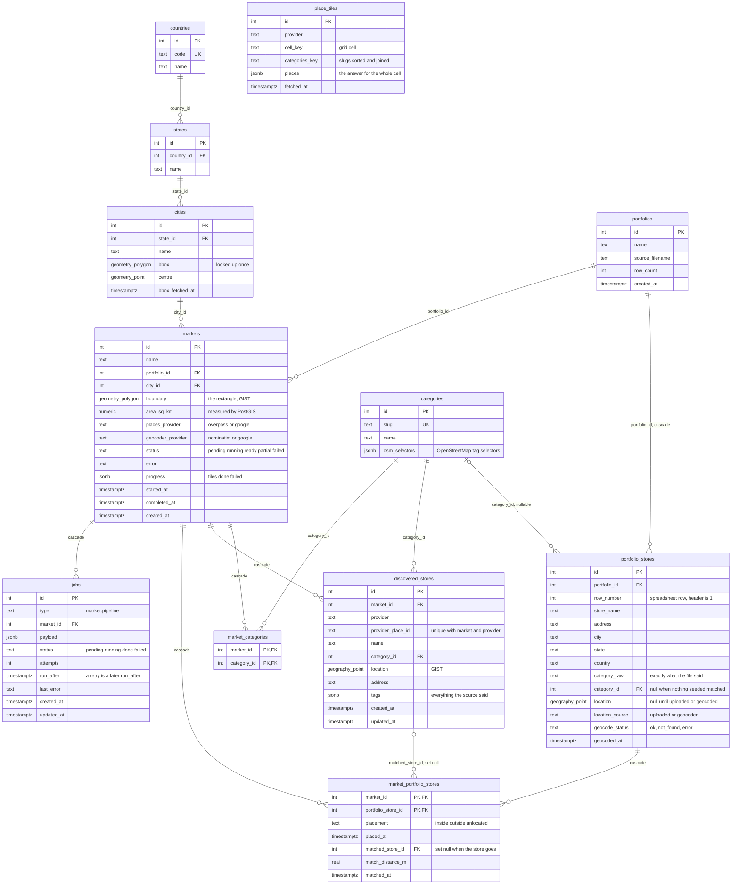

# Database

PostgreSQL 16 with PostGIS. Every point is `geography(Point, 4326)`, so distances are metres on the sphere; every
boundary is `geometry(Polygon, 4326)` with a GIST index, so containment and area are one function call. The schema is
owned by the migrations in `apps/api/src/db/migrations`, applied with `npm run migrate`; the seeds load the location tree
and the categories.

The schema is drawn three ways, so it can be read anywhere: as an entity diagram below, also editable in diagrams.net
([`diagrams/er.drawio`](diagrams/er.drawio)); as DBML for [dbdiagram.io](https://dbdiagram.io)
([`diagrams/schema.dbml`](diagrams/schema.dbml), paste it in); and as a Mermaid diagram further down that GitHub renders
on its own.

**Reading the diagram.** The location tree runs down the left: a state points at its country, a city at its state, and a
market at its city. `markets`, top centre, is what everything else belongs to: `discovered_stores` to its right and
`market_portfolio_stores` below both point at it and go with it when it is deleted, as does the `jobs` row queued for
it. `market_portfolio_stores` joins a market to a `portfolio_stores` row and carries the placement and, when found, the
discovered store it was matched to, a link that is cleared rather than broken when that store goes. `portfolio_stores`
and `discovered_stores` both point at `categories`, as does `market_categories`, the set a market was asked for.
`place_tiles`, bottom right, belongs to no market: it is the discovery cache, keyed by source, grid cell and category
set, and outlives the markets that filled it.

## The same schema as Mermaid

## How the tables are used

| Table | Written by | Read by |
|---|---|---|
| `countries`, `states`, `cities` | seeds; `cities.bbox` by the first city lookup | the setup screen's selects; geocoding, to bound address lookups to the city |
| `categories` | seeds | the setup screen; discovery, for the OpenStreetMap selectors |
| `portfolios`, `portfolio_stores` | the upload, in one transaction after the whole file validates; geocoding fills `location` | placement, matching, the dashboard list |
| `markets`, `market_categories` | create and edit; the pipeline updates status, progress, error | everything |
| `discovered_stores` | discovery, upsert per grid cell; cleared by an edit | the dashboard, matching |
| `market_portfolio_stores` | placement (rewritten every run); matching fills the pair | the dashboard, the market's counts |
| `place_tiles` | discovery, once per cell and category set | discovery, for `TILE_CACHE_HOURS` |
| `jobs` | create, edit, run again; the worker's claim, complete and fail | the worker's claim (`FOR UPDATE SKIP LOCKED` over `status, run_after`); the market's `busy` |

Everything that belongs to a market cascades from it, so a delete is one statement, and a matched store that disappears
leaves the placement row with its pair cleared rather than a dangling reference.
