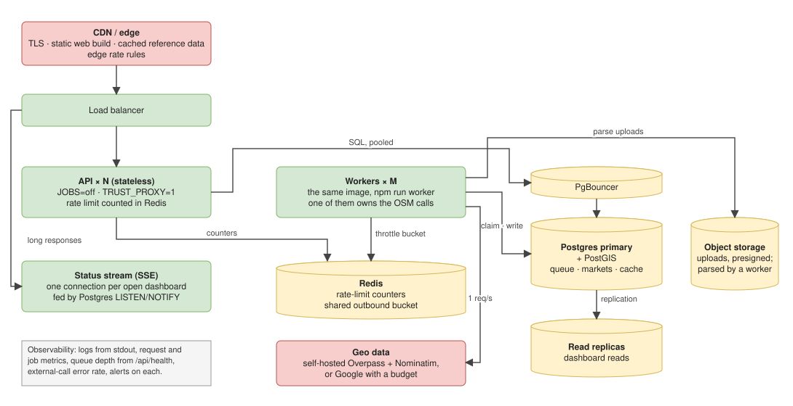
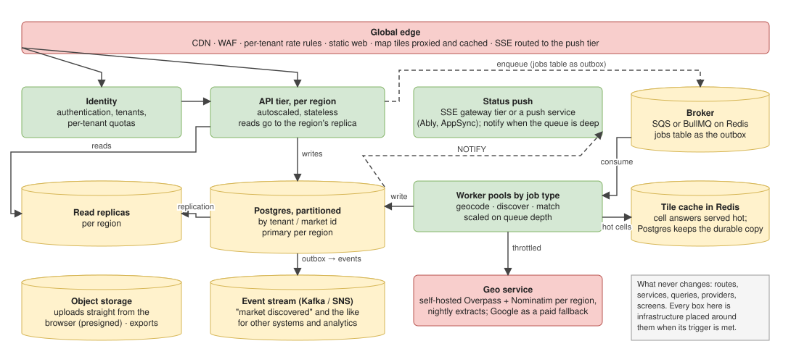

# Production

One idea throughout: the same code runs at every stage, and what changes is the infrastructure around it and the
environment variables that point at it. This page holds the plan by stage, the shape at a million and at ten million
users, every scaling limit with its options weighed, and the register of what would be built and when.

## Contents

1. [The short version](#the-short-version)
2. [The deployment plan, by stage](#the-deployment-plan-by-stage)
3. [A million users](#a-million-users)
4. [Ten million and beyond](#ten-million-and-beyond)
5. [Each scaling limit, with its options](#each-scaling-limit-with-its-options)
6. [The upgrade register](#the-upgrade-register)
7. [Inbound rate limiting in depth](#inbound-rate-limiting-in-depth)

## The short version

The first deployment is the API and the worker as two services from one image, a managed Postgres with PostGIS behind a
connection pooler, the web app built with `NEXT_PUBLIC_API_URL` pointing at the API's own domain, and a CDN in front.
Migrations run from a release step, secrets live in the platform's store, `/api/health` is the readiness probe.

The application tier scales by instances because it holds no state: sessions live in the browser, jobs in the database,
and the queue is safe for many workers. Two things do not scale that way. The database gets replicas, a maintained
store count and, much later, partitioning. The external services are the hard ceiling: the grid cache does most of the
work, and past a few hundred markets a day the choice is self-hosted OpenStreetMap data or a paid provider.

### What a million users at once would break, in order

1. The connection pool: ten per instance. A pooler and more instances.
2. The single Node process: CPU on JSON, memory on uploads. Instances, and uploads to object storage.
3. The web server in the path of every API call, locally. Deployed, the browser calls the API directly.
4. The external services, absolutely. Cache, then own the data or pay for it.
5. Polling: a million dashboards every two seconds. Server-sent events fed by `LISTEN/NOTIFY`.

Every knob these need already exists as an environment variable with a local default; see [CONFIGURATION.md](CONFIGURATION.md).

## The deployment plan, by stage

The rule throughout: the same code runs at every stage; each stage adds infrastructure and changes environment variables.
The code-side knobs already exist (the configuration reference). Capacity numbers are in
[the register](#the-upgrade-register). Everything in a stage is a prerequisite for the next.

### Stage 0 — local (today)

One process runs the API and the worker; Postgres in Docker on 5432; the browser reaches the API through the Next rewrite.
Environment: all defaults. Anything committed or shared says 5432.

### Stage 1 — first deployment (tens to hundreds of users)

| Piece | Choice | Environment |
|---|---|---|
| Database | managed Postgres with PostGIS; a pooler (PgBouncer or the provider's) | `DATABASE_URL` to the pooler, `DB_POOL_MAX=20` |
| API | one container from `apps/api/Dockerfile` | `JOBS=off`, `TRUST_PROXY=1`, `CORS_ORIGIN=https://app.example.com`, `RATE_LIMIT_PER_MINUTE=120` |
| Worker | one container from the same image, `node src/worker.ts` | `JOBS` irrelevant; `PLACES=live`, `NOMINATIM_USER_AGENT` a real contact |
| Web | the standalone image from `apps/web/Dockerfile`, or a static host | `NEXT_PUBLIC_API_URL=https://api.example.com` |
| Edge | a CDN or the host's proxy in front of both; TLS; `Cache-Control` honoured | — |
| Observability | logs shipped from stdout; alerts on 5xx rate and on `/api/health` 503 | — |

Checklist before the first traffic: migrations run from a release step (`node src/db/migrate.ts` in the API image), not at
container start; secrets in the platform's store, not in files; `/api/health` wired as the readiness probe; graceful shutdown tested
(the worker stops before the database closes).

### Stage 2 — thousands of concurrent users

- Several API instances behind the load balancer. The API keeps nothing in memory that matters, so this is a scaling knob.
- The rate limiter's store moves from memory to Redis (`rate-limit-redis`), or a per-instance limit is accepted and set lower.
- Two or three workers. `SKIP LOCKED` makes them safe; `JOB_STALE_MINUTES` makes a dead one recoverable.
- `TILE_CACHE_HOURS` raised to 72: the cache is what keeps discovery inside the external limits as markets multiply.
- Uploads move to object storage and are parsed by the worker (register row 7) if uploads become frequent.
- Metrics: request latency, job duration, queue depth from `/api/health`, external-call error rate.

### Stage 3 — a million users

The application tier scales by instances; the two things that do not are the database and the external services.

- **Database**: read replicas for dashboard reads; the market's `store_count` becomes a maintained column (row 13); partition
  `discovered_stores` by market if it reaches hundreds of millions of rows.
- **External services**: at this volume public OSM mirrors are not an option. Either self-hosted Overpass and Nominatim
  (a machine each, with data refreshed nightly) or Google Places with a paid quota and a budget alert. The grid cache
  stays and does most of the work either way.
- **Status**: server-sent events replace polling (row 12), behind a proxy configured for long responses.
- **Queue**: if pickup latency or fan-out becomes a problem, BullMQ on Redis or SQS with the `jobs` table as the outbox (row 11).
- **Identity**: authentication and per-user quotas (row 16) — the brief assumed one user; a million of them need names.

### What never changes

The routes, the services, the queries, the providers and the screens. Every item above is an environment variable, a
container, or a managed service placed around them.

## A million users

**The flow at a million.** Every request enters through the CDN and the load balancer. Page and API reads hit one of N
stateless API instances, which reach Postgres through PgBouncer and keep their rate-limit counters in Redis. A dashboard
that is watching a run holds one server-sent-events connection instead of polling, fed by Postgres notifications.
Uploads go to object storage and are parsed by a worker. Workers claim jobs from the primary, share one outbound throttle
in Redis, and ask the geo data at the permitted rate, self-hosted or Google. Reads that can be a second old go to the
replicas. Logs and metrics leave every box.

What changes shape, in the order the [scaling limits](#each-scaling-limit-with-its-options) say it bites:

| Limit | At a million | Trade-off |
|---|---|---|
| The connection pool and the single process | N stateless API instances behind a balancer, PgBouncer in front of Postgres | free; the code holds no state |
| Reads | read replicas for dashboard reads | a dashboard may read a status a second old |
| Uploads in the request | presigned upload to object storage, parsed by a worker, answered 202 | the upload screen becomes "result in a moment" |
| Status by polling | server-sent events fed by `LISTEN/NOTIFY`, one connection per open dashboard | connections held per instance; proxies must allow long responses |
| Limits counted per process | rate-limit counters and the outbound throttle bucket in Redis; or one worker owns the OSM calls | Redis becomes a dependency |
| The external services | self-hosted Overpass and Nominatim with nightly extracts, or Google with a budget alert | operations work versus cost per call and lock-in |
| Recovery | worker heartbeats and short leases on jobs; claims filtered by type | more bookkeeping on the queue |

Capacity of this shape: bounded by the geo data. Self-hosted, thousands of markets a day; the application tier scales
linearly and the database vertically until the store tables reach hundreds of millions of rows.

## Ten million and beyond

**The flow at ten million.** The global edge terminates TLS, applies per-tenant rules, serves the static web app and
proxies map tiles. Identity authenticates every request before the regional API tier sees it. Writes go to the region's
partitioned primary; reads to its replicas; uploads go straight from the browser to object storage with a presigned URL.
A create writes the market and its job in one transaction as before, and the outbox relays the job to the broker; worker
pools sized per job type consume it, read hot grid cells from Redis, call the regional geo service at its rate, and write
results back to the primary. The primary's notifications feed the push tier that keeps dashboards live, and its outbox
feeds the event stream other systems read.

At this size the things that were "later" arrive together, and the plan is honest about what each costs.

| Change | Why now | Pros | Cons |
|---|---|---|---|
| Identity and tenants | ten million people need names, quotas and their own data | per-tenant limits, billing, isolation | authentication touches every route; a migration of the single-user tables to tenant-scoped ones |
| Regions | latency and a single region's ceiling | reads served locally; blast radius per region | data placement rules; the geo data per region; cross-region jobs |
| A broker with the jobs table as outbox | fan-out, priorities, worker pools by job type, scaling on depth | proven at any volume; the outbox keeps the market and its job transactional | a second system; the outbox loop to keep consistent |
| Partitioned Postgres by tenant or market | store tables in the billions of rows | maintenance and vacuum per partition; drops are cheap | a partition key in every query; cross-tenant queries become reports |
| Tile cache in Redis, Postgres as the durable copy | cell answers read at memory speed by many workers | hot cells served without a database round trip | two copies to keep in step; memory cost |
| A geo service of its own | the external limit is the ceiling for everyone | self-hosted per region, refreshed nightly; Google as a paid fallback for what OSM lacks | the heaviest operational piece in the system |
| Push for status | millions of open dashboards | connections are a gateway tier's or a vendor's problem | cost per connection; the worker publishes to it as well as to Postgres |
| An event stream | other systems and analytics want "market discovered" | decoupled consumers, replay | beside the queue, never instead of it |

What never changes: routes, services, queries, providers and screens. Every box in the last two diagrams is
infrastructure placed around them, added when its trigger is met and not before. That is the whole design principle: the
code is written for the shape it will have, and configured for the shape it has.

## Each scaling limit, with its options

A scaling limit is a design choice that is right at today's size and wrong at some larger size. Each entry says what the
limit is, what makes it bite, the options with pros and cons, the one we would pick, and the number that triggers it. The
[register](#the-upgrade-register) below holds the same items as a table; the [plan](#the-deployment-plan-by-stage) above
places them in stages.

---

### 1. Dashboard status by polling

**The limit.** A dashboard asks for its market every two seconds while the market is being built, and its stores list beside
it once discovery has started, so stores appear as they are found; both stop when the run ends. Cost scales with markets in
progress, not with users; a million users with finished markets make no requests.

**When it bites.** Thousands of dashboards open during runs at the same moment, or a queue deep enough that people watch for
minutes. Roughly: 5,000 concurrent open runs is 5,000 requests a second of status and store reads.

| Option | Pros | Cons |
|---|---|---|
| Keep polling, lengthen the interval as depth grows (2 s, then 5 s, then 15 s) | no new code paths; trivial | latency to the user grows; still one request per tab per interval |
| **Server-sent events**: one open connection per dashboard, the API pushes each change, fed by Postgres `LISTEN/NOTIFY` from the worker | no requests between changes; instant updates; plain HTTP, works through most proxies; no client library | connections are held per API instance, so the tier scales by open connections; proxies must allow long responses; needs a reconnect path (browsers do this natively) |
| WebSockets | two-way, if the dashboard ever needs to send | more moving parts than SSE for a one-way stream; harder through proxies and CDNs |
| Push service (Ably, Pusher, AWS AppSync) | connections are someone else's problem at any scale | cost per connection; a dependency; the worker must publish to it as well as to Postgres |
| Notify instead of watch (email or push when done) | zero connections; right for a queue that is hours deep | not a replacement for the first minute, when the user is looking |

**Pick.** Server-sent events when the trigger is met; notification on top when the queue is deep. **Trigger:** more than a
few hundred open runs at once, or a median wait over a minute.

---

### 2. The external services' rate limits

**The limit.** Public Overpass and Nominatim allow about one request per second per client. A 20 km² market is six cells,
so roughly one market every six seconds and one address a second, for the whole deployment.

**When it bites.** More than a few hundred markets a day, or geocoding more than a few thousand addresses a day. This is
the hard ceiling; nothing in the application tier raises it.

| Option | Pros | Cons |
|---|---|---|
| **The grid cache** (done): a cell answered once serves every market that covers it for a day | free; already in; markets in a city overlap heavily | cold cells still cost a call; first market in a city pays full price |
| Self-hosted Overpass and Nominatim | no per-client limit; data under our control | two servers to run and refresh (planet or country extracts, nightly); operations work; disk and memory |
| Google Places (New) and Google Geocoding | high quotas, better addresses, no operations | cost per call; a budget to watch; a key to protect; provider lock-in for that path |
| Longer cache (72 h or more) | fewer calls | staler stores; a shop that closed last week is still listed |

**Pick.** Cache first (done), then the provider decision when volume demands: Google for speed to market, self-hosting when
volume is steady and cost matters. **Trigger:** more than a few hundred markets a day.

---

### 3. One outbound throttle per process

**The limit.** Each worker process throttles itself to one request a second per service. Two workers make two a second,
which the public mirrors will refuse.

| Option | Pros | Cons |
|---|---|---|
| One worker only | nothing to build | one machine's worth of throughput; no redundancy |
| A shared token bucket in Redis, checked before every outbound call | any number of workers share one limit | a new dependency (Redis); a network round trip per outbound call |
| One worker dedicated to OSM calls, others for everything else | no new dependency; the limit stays in one process | job types must be routed by worker; uneven load |

**Pick.** The dedicated OSM worker until self-hosted or paid providers remove the limit; then a shared bucket if several
workers still need to be polite to one service. **Trigger:** the second worker process.

---

### 4. Inbound rate limit counted per instance

**The limit.** `express-rate-limit` keeps counters in the process's memory. With N instances the effective limit is N times
the configured number, and a client that happens to land on a fresh instance starts from zero.

| Option | Pros | Cons |
|---|---|---|
| Accept it and set the number lower | nothing to build | bursts across instances go unnoticed; limits become approximate |
| Shared store in Redis (`rate-limit-redis`) | one true count across instances | Redis; one round trip per request |
| Rate limiting at the edge (CDN or load balancer rules) | no code; enforced before the API is reached | coarser rules; vendor-specific |

**Pick.** Edge rules for the crude protection, Redis store when per-user quotas arrive with authentication. **Trigger:** the
second API instance.

The full menu of inbound options in code and infra, with boilerplate, is in [Inbound rate limiting in depth](#inbound-rate-limiting-in-depth) below.

---

### 5. One database, one pool of ten

**The limit.** Each API instance opens at most ten connections; every read and write goes to one Postgres.

| Option | Pros | Cons |
|---|---|---|
| Bigger pool and a connection pooler (PgBouncer or the provider's) | the cheapest large gain; no code | a pooler in transaction mode breaks session features (none used here) |
| Read replicas for dashboard reads | reads scale out; writes untouched | replication lag: a dashboard may read a status a second old; two connection strings |
| Maintained `store_count` column instead of a subquery per market read | market list stays fast at thousands of markets | one more thing to keep in step, in the same transaction as the insert |
| Partition `discovered_stores` by market | very large tables stay manageable | operational complexity; only at hundreds of millions of rows |

**Pick.** Pooler first, replicas when reads dominate, the column when the list slows. **Trigger:** more than ~50 concurrent
requests per instance; then dashboard read latency.

---

### 6. File parsing in the request

**The limit.** A 5 MB CSV or workbook is held in memory and parsed on the request's thread; that blocks the event loop for
roughly a hundred milliseconds, per upload, per instance.

| Option | Pros | Cons |
|---|---|---|
| Keep the 5 MB cap (done) | bounded cost; simple | larger portfolios cannot be uploaded |
| Upload to object storage, parse in the worker, answer 202 with a status | any file size; no event-loop blocking; the upload screen already knows how to poll a status | the upload screen changes from "result now" to "result in a moment"; object storage is new infrastructure |
| Parse in a worker thread inside the API | no new infrastructure | still holds the file in one instance's memory; threads add complexity for a small gain |

**Pick.** Object storage plus the worker, the day the cap is too small. **Trigger:** a real portfolio over 5 MB, or dozens of
concurrent uploads.

---

### 7. Job pickup by polling the table

**The limit.** The worker asks the jobs table every two seconds. Pickup latency is up to two seconds; each poll is one cheap
indexed query per worker.

| Option | Pros | Cons |
|---|---|---|
| Keep polling | nothing to build; two seconds is invisible next to a run that takes longer | N workers make N polls every two seconds |
| Postgres `LISTEN/NOTIFY`: the insert notifies, the worker wakes at once | instant pickup; no new dependency; polling kept as the fallback | a dedicated connection per worker; notifications are not durable, hence the fallback |
| A broker (BullMQ on Redis, SQS) with the jobs table as outbox | fan-out, priorities, delayed jobs for free | a second system; the outbox loop to keep them consistent |

**Pick.** `LISTEN/NOTIFY` if latency ever matters; a broker only when a second service consumes the work. **Trigger:** pickup
latency becomes user-visible, or a second consumer appears.

---

### 8. The tile cache grows by age only

**The limit.** Expired rows are overwritten when their cell is asked again and otherwise stay; there is no way to force a
fresh answer before the TTL.

| Option | Pros | Cons |
|---|---|---|
| Leave it | bounded by geography × categories; grows slowly | stale rows for cells nobody revisits; no forced refresh |
| A nightly purge of rows past the TTL | table stays tidy; one SQL in a scheduled job | a scheduled job to run somewhere |
| A refresh flag on re-run that bypasses the cache for that market | the user can get today's answer | one more thing on the re-run request (the "run again" endpoint) |

**Pick.** Both small pieces, with a refresh flag on "run again". **Trigger:** the table is noticed, or a user needs today's answer.

---

### 9. The web server proxies every API call (local only)

**The limit.** Locally the browser calls `/api/...` on the web server, which forwards to the API. Deployed that way, the
web server sits in the path of every request.

| Option | Pros | Cons |
|---|---|---|
| Keep the rewrite deployed | one origin, no CORS | the Next server becomes a second bottleneck and a single point of failure for the API |
| **Direct API URL** (done as configuration: `NEXT_PUBLIC_API_URL` + `CORS_ORIGIN`) | the web tier serves pages only; the API scales alone | CORS to configure; the API URL baked into the web build |

**Pick.** Direct, from the first deployment. **Trigger:** deployment.

---

### Not limits: what already scales

The API keeps nothing in memory that matters, so instances multiply freely. The queue is transactional and safe for many
workers. Every pipeline step is idempotent, so retries and re-runs are harmless. Every outbound call is throttled,
identified, timed out and retried in one place. Reference data carries cache headers so a CDN can serve it.

## The upgrade register

Everything deliberately left out of the core build, with the trigger that would make it necessary and what it would replace.
Nothing here is a bug; each is a choice sized to the brief (one user, one market at a time, a few markets a day). Add to
it whenever a decision is made "for now".

Local infrastructure is Docker on the laptop; deployed infrastructure is the managed equivalent. The rule for every row: the
same code runs in both, and the difference is configuration.

### Capacity today (single API instance, one worker, public OSM services)

| Flow | Bound by | Roughly holds |
|---|---|---|
| Browsing: reference data, market reads, dashboard polling | one Node process, Postgres pool of 10 | a few hundred concurrent users |
| Uploads | 5 MB held in memory per request, one CPU parse per upload | tens of concurrent uploads |
| Market creation → discovery | Overpass at ~1 request/second per client; a 20 km² market is 4 tiles | one market every ~5 s, ~700 an hour, **globally** |
| Geocoding  | Nominatim at 1 request/second per client | 3,600 addresses an hour, **globally** |

The external rate limits are the real ceiling. No amount of scaling the app raises them; only caching, self-hosting the data,
or a paid provider does.

### The register

| # | Upgrade | In code? | Trigger | Replaces / adds | Local | Deployed |
|---|---|---|---|---|---|---|
| 1 | API and worker as separate services (`JOBS=off` on API, `npm run worker`) | yes (worker.ts, JOBS) | first deployment | one process doing both | one process | two services, same database |
| 2 | Managed Postgres with a connection pooler (PgBouncer or the provider's) and a bigger knex pool | knob (DB_POOL_MAX) | more than ~50 concurrent requests | pool of 10 to one instance | Docker Postgres | managed Postgres + pooler |
| 3 | Horizontal API instances behind a load balancer | yes (stateless) | one instance's CPU or memory saturates | one process | one process | N stateless instances; nothing is in process memory that matters (session state is in the browser, jobs in the database) |
| 4 | Cache-Control on reference data (`/api/locations`, `/api/categories`, `/api/providers`) and a CDN in front | yes (Cache-Control) | any real traffic | every request hitting Postgres | none | CDN / edge cache |
| 5 | Browser talks to the API's own domain (`NEXT_PUBLIC_API_URL`) instead of the Next rewrite proxy | yes (NEXT_PUBLIC_API_URL, CORS_ORIGIN) | deployment | Next proxying every API call | rewrite to 4200 | direct, with CORS |
| 6 | Inbound rate limiting (`express-rate-limit`) and per-user quotas | yes (rate limit, per instance) | facing the internet; quotas need auth first | nothing | on, generous | on, tuned |
| 7 | Upload to object storage and parse in the worker; answer 202 with a status | infra | files larger than the cap, or many concurrent uploads | in-memory multer + parse in the request | local disk / MinIO | S3-compatible bucket |
| 8 | Tile result cache keyed by (provider, tile, categories) with a TTL of hours | yes (grid + place_tiles) | any market volume: markets in one city overlap heavily | one Overpass call per tile per market | Postgres table | same table, or Redis |
| 9 | Self-hosted Overpass and Nominatim, or Google Places with paid quota | infra | more than a few hundred markets a day, or geocoding more than a few thousand addresses | public OSM mirrors and their per-client limits | not needed | provider decision + budget |
| 10 | Worker wake-up by `LISTEN/NOTIFY` instead of a 2 s poll | infra | pickup latency ever matters | polling | same code | same code |
| 11 | Several workers, then a broker (BullMQ on Redis, or SQS) with the `jobs` table as outbox | infra | jobs queue faster than they drain, or a second service consumes them | one worker on the table | Docker Redis | managed Redis / SQS |
| 12 | Dashboard status by server-sent events instead of polling | infra | many open dashboards while runs are in flight | 1 request / 2 s / tab | same | same, behind a proxy that allows long responses |
| 13 | Maintained `store_count` column instead of a subquery in the market read | infra | thousands of markets in the list | `COUNT` subquery per row | same | same |
| 14 | Event stream (Kafka or SNS) for "market discovered" and similar facts | infra | other systems must consume them | nothing | not needed | add beside the queue, never instead of it |
| 15 | Observability: request metrics, job metrics, queue depth, external-call latency and error rate | partly (health depth, logs) | deployment | pino logs only | logs | logs + metrics + alerts |
| 16 | Authentication and per-user data | infra | more than one user | single-user assumption from the brief | none | identity provider |
| 17 | Recovery of a market stuck at `running` after a worker crash, or done with gaps | yes (stale reclaim; run again on any finished market) | first crash or first 504 | nothing | run again | worker heartbeat + reclaim of stale `running` jobs |
| 18 | Tile cache housekeeping: a periodic purge of entries older than the TTL, and a "refresh" flag on a run again that bypasses the cache for that market | infra (one SQL in a scheduled job; the flag rides on `POST /api/markets/{id}/runs`) | the table grows past what is comfortable, or a user needs today's answer before the TTL | expiry by age only, stale rows overwritten on next use | same | same |
| 19 | Outbound throttle shared across workers (a token bucket in Redis, or one worker dedicated to OSM calls) | infra | more than one worker process: today's throttle is per process, so N workers make N× the rate the mirrors allow | p-throttle inside each provider's client | one worker | shared bucket or a single OSM worker |
| 20 | Honour `Retry-After` on 429 from the external services, and split the inbound limit per route (uploads and market creation stricter than reads) | code (small) | the first 429 with a Retry-After, or abuse of the write routes | fixed backoff; one limit for every route | same | same |
| 22 | Geocoding quality: a structured Nominatim query (street and city as separate fields), then a fallback to the locality alone stored with a precision flag, so a store the geocoder cannot pin to its street still appears at neighbourhood level | code (small) | a real portfolio with more than a few `not_found` rows (the sample already has one: ITPL Main Road, Whitefield) | one free-text query, found or not | same | same |
| 23 | Pagination and a bounding-box filter on `GET /api/markets/{id}/stores` (cursor by layer+name, `bbox=` for the visible map area), with the map switched to its canvas renderer (colours must then be concrete values, not CSS variables) | code (small) | a market with thousands of stores, or list or map rendering that lags | the whole filtered list in one response, SVG markers | same | same |
| 24 | Queue hygiene: `claim()` filtered by the worker's handler types; a `queue` column so a worker takes only its own queue; `locked_by` (host + pid) and `locked_until` on every claim, so who holds a job is visible and a dead holder's lease expires | code (small) | the first deployment with specialised workers, or the first "who took my job" question | every worker takes every job, anonymously | same | same |
| 25 | Tests own their database: `TEST_DATABASE_URL`, created, migrated and seeded by the test runner, never the dev database; CI gets an ephemeral Postgres per run. No server ever runs against it | yes (test/database.ts, test/integration.ts); CI pending | the first shared developer database, and CI | route tests against whatever `DATABASE_URL` says, worker off by convention | a second database in the same Docker Postgres | a service container in CI |
| 26 | Environment isolation for the queue: one database and one set of credentials per environment, the production database unreachable from laptops, the worker's `JOBS=on` refused outside `NODE_ENV=production` unless set on purpose | infra | deployment | one `.env` on one laptop | same code, per-developer `.env` | secrets per environment, network rules |
| 27 | Match quality: a name-similarity check (`pg_trgm`) as tie-breaker and threshold, so a different shop of the same category within 150 m is not a confident pair | code (small) | the first pair a user disputes | distance and category only | same | same |

The [plan](#the-deployment-plan-by-stage) places these in stages; [each limit above](#each-scaling-limit-with-its-options) has its options with their pros and cons.

### Answering "one million users at once"

It would not hold, and no single-node configuration would. What breaks, in order:

1. **The Postgres pool.** Ten connections per instance queue behind each other; requests time out. Rows 2 and 3.
2. **The instance.** One Node process saturates on CPU for JSON and on memory for uploads. Rows 3, 4, 7.
3. **The proxy.** Every API call passes through the Next server; it becomes a second bottleneck. Row 5.
4. **The external services, and this one is absolute.** A million market creations means millions of Overpass calls; the public
   mirrors would refuse the client long before, and rightly. Rows 8 and 9 are the only answers: cache what overlaps, then
   own the data or pay for it.
5. **Polling.** A million dashboards polling every two seconds is half a million requests a second for status. Row 12.

What already holds at that scale: the API keeps no state in memory, so instances multiply freely; the queue is transactional
and multi-worker safe; discovery is idempotent, so retries and re-runs are harmless; every third-party call is throttled,
identified and retried in one place.

## Inbound rate limiting in depth

Everything that can be done to protect **this API from its clients** — how fast a caller may hit it — beyond the one
global limiter shipping today. This is the opposite direction from the outbound throttle in
`apps/api/src/lib/http.ts`, which limits how fast _we_ call Overpass, Nominatim and Google (register rows 19–20); this
section is inbound only. Nothing here is built — the brief is one user at a few markets a day — so each item names its
register row.

### What exists today

One global limiter in [`apps/api/src/app.ts`](../apps/api/src/app.ts): `express-rate-limit`, a one-minute fixed window,
`RATE_LIMIT_PER_MINUTE` (default 300) requests per client, a `429 RATE_LIMITED` past it, `RateLimit-*` headers on every
response, and `app.set('trust proxy', TRUST_PROXY)` so the client IP is read from `X-Forwarded-For` behind a balancer
rather than the balancer's own IP being limited. Its two honest limits: the count is **per process**, so N instances
allow N× the number (limit 4 above, register row 6), and there is **one limit for every route** regardless of cost
(register row 20).

### Code-level options

- **Per-route and per-method limits (row 20).** Split the single limit: a strict number on the expensive write routes
  (upload, market creation, which each kick off dozens of external calls) and a generous one on the cheap reads.
- **Per-user quotas, not just per-IP (rows 6, 16).** Per-IP punishes a shared office address and is dodged by a botnet;
  once there is authentication, key the limiter on the user id and fall back to the IP for anonymous routes.
- **Weighted / cost-based limiting.** Count cost, not requests: price each route and debit a per-client budget, so a few
  expensive calls weigh the same as many cheap ones. A library such as `rate-limiter-flexible` consumes points per call.
- **`Retry-After` on the 429.** Tell the client how many seconds to wait instead of leaving it to retry blindly; the
  limiter already knows when the window resets.
- **Slow down before blocking.** `express-slow-down` adds growing latency as a client nears the limit — gentler
  back-pressure that legitimate clients absorb and abusers feel, short of a hard refusal.
- **Idempotency keys on writes.** Rate limiting caps how often; an `Idempotency-Key` header, recorded with its first
  response and replayed on repeats, removes the reason to retry fast — a retried market creation never runs twice.
- **Resource limits are rate limits too.** Already in place: the 1 MB JSON body cap and the 5 MB upload cap bound cost by
  size, not count. A request timeout and a maximum query length belong in the same category.

### Infra-level options

- **A shared counter across instances (rows 4, 6).** The moment there is a second instance, the in-memory count is
  wrong; moving the store to Redis (`rate-limit-redis`) gives all instances one true count.
- **Enforce at the edge.** A CDN, WAF or load-balancer rule (Cloudflare, AWS WAF, an nginx `limit_req` zone) drops
  abusive traffic before it reaches a Node process — cheaper, and the only thing that survives a volumetric flood the
  app could never count.
- **A WAF or API gateway.** For patterns a counter cannot catch — credential stuffing, scrapers, layer-7 DDoS — a WAF
  sits in front; and if the API becomes a platform, a gateway (Kong, AWS API Gateway, Apigee) centralises API keys,
  per-plan quotas and per-consumer tiers in one managed place.
- **Connection-level backstops.** Cap concurrent connections per IP at the balancer and set server timeouts, so a client
  opening thousands of slow connections (Slowloris) is bounded before the request counter even engages.

### What to reach for first

Edge enforcement and the Redis-backed shared counter come first: volumetric abuse should die before it touches a Node
process, and a per-process count is only exact for one instance. Per-route (row 20) and per-user (rows 6, 16) limits
follow with authentication. Cost-based limiting, slow-down and idempotency are refinements for a specific route's abuse
profile. Each is in the register with its trigger rather than built now.
