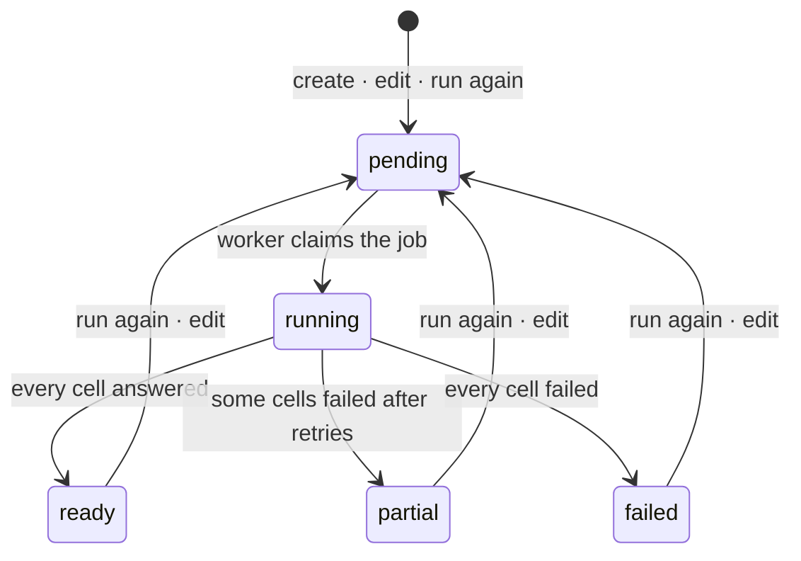
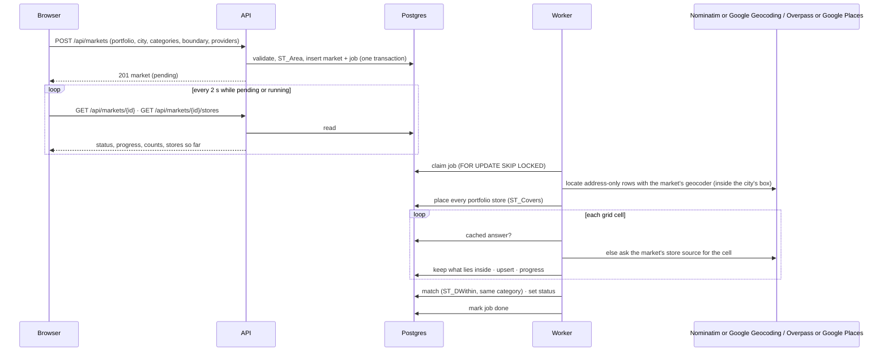

# Low-level design

How the code is organised, the contracts between its parts, the few pieces of SQL that carry the product, and the
sequences that matter. The high-level companion is [HLD.md](HLD.md).

## Modules

| Path | Responsibility |
|---|---|
| `packages/shared/src/geo.ts` | boundary maths: area, dimensions, grid cells, containment, the area cap, the default market, the match distance |
| `packages/shared/src/portfolio.ts` | the file contract: required and optional headers, row validation, the issue shape |
| `apps/api/src/config.ts` | one zod schema for every variable; the process fails at start-up with the variable named |
| `apps/api/src/app.ts` | the Express app: helmet, compression, CORS, rate limit, request log, routes, OpenAPI, the error handler, the 404 |
| `apps/api/src/routes/*` | one router per resource; zod parses params, query and body; hands off, never decides |
| `apps/api/src/services/*` | the rules: the market ladder, the upload's validate-then-store, run again, edit, delete |
| `apps/api/src/queries/*` | every SQL statement, one file per table group; each takes the connection last so a transaction can be passed |
| `apps/api/src/providers/*` | `Geocoder` and `PlacesProvider` interfaces; Nominatim, Google Geocoding, Overpass, Google Places (New), the fixture twins; one resolver rule for a market's choices; availability |
| `apps/api/src/lib/http.ts` | the one outbound client: throttle (`p-throttle`), retry with backoff (`p-retry`), timeout, `User-Agent` |
| `apps/api/src/jobs/*` | the queue runner and the four pipeline steps; `pipeline.ts` orders them |
| `apps/api/src/openapi/*` | the registry the routes describe themselves into; the document served at `/api/docs` |
| `apps/web/src/api/client.ts` | typed fetch: JSON in and out, the error envelope as `ApiError`, 204 as nothing |
| `apps/web/src/api/hooks.ts` | one React Query hook per endpoint; polling rules; the mutations |
| `apps/web/src/app/providers.tsx` | theme, query client, and the session: the portfolio uploaded and the market open |
| `apps/web/src/app/{page,setup,dashboard}` | the three screens; `dashboard/[id]` is the market, `dashboard` the list |
| `apps/web/src/components/*` | the maps (Leaflet, client-only), the stepper, the layer vocabulary, the category icons |

## Contracts

**Errors.** Every failure is `{ error: { code, message, details? } }`. Services throw `badRequest`, `notFound` or
`conflict` from `lib/errors.ts`; the error handler renders them; anything else is a 500 with the message logged and hidden.
The web client turns the envelope into an `ApiError` with `code`, `status` and `details`, and screens switch on `code`.

**Validation.** Shape at the route with zod; rules in the service, in a fixed order that the tests mirror: shape, size
measured by PostGIS, providers available, references exist, categories known. The same ladder serves create and edit.

**The market's `busy`.** `status = 'running' OR EXISTS (job pending or running for it)`, computed in the market read.
Run again, edit and delete refuse with 409 while busy; the screens hide the controls behind the same flag.

## State



A job: `pending → running → done | failed`; a retry is a pending job with a later `run_after`; a job still running after
`JOB_STALE_MINUTES` is claimed again as if abandoned.

## Sequences

Creating a market and watching it:



Editing a market is the same sequence after `PUT`, with the discovered stores cleared first; run again skips the
rewrite and only queues.

## The SQL that carries the product

**Claiming a job**, safe for any number of workers:

```sql
UPDATE jobs SET status = 'running', attempts = attempts + 1, updated_at = now()
 WHERE id = (SELECT id FROM jobs
              WHERE (status = 'pending' AND run_after <= now())
                 OR (status = 'running' AND updated_at < now() - (:staleMinutes * interval '1 minute'))
              ORDER BY created_at LIMIT 1 FOR UPDATE SKIP LOCKED)
 RETURNING *;
```

**Placing every portfolio store** in one statement (`ST_Covers` includes points exactly on the edge):

```sql
INSERT INTO market_portfolio_stores (market_id, portfolio_store_id, placement, placed_at)
SELECT m.id, s.id,
       CASE WHEN s.location IS NULL THEN 'unlocated'
            WHEN ST_Covers(m.boundary, s.location::geometry) THEN 'inside' ELSE 'outside' END, now()
  FROM markets m JOIN portfolio_stores s ON s.portfolio_id = m.portfolio_id
 WHERE m.id = :id
ON CONFLICT (market_id, portfolio_store_id) DO UPDATE SET placement = EXCLUDED.placement, placed_at = EXCLUDED.placed_at;
```

**Matching**: the nearest discovered store of the same category within the radius, per portfolio store, after clearing
last run's pairs:

```sql
UPDATE market_portfolio_stores p
   SET matched_store_id = near.id, match_distance_m = near.distance_m, matched_at = now()
  FROM portfolio_stores s
 CROSS JOIN LATERAL (
       SELECT d.id, ST_Distance(d.location, s.location) AS distance_m
         FROM discovered_stores d
        WHERE d.market_id = :marketId AND ST_DWithin(d.location, s.location, :radius)
          AND (s.category_id IS NULL OR d.category_id = s.category_id)
        ORDER BY d.location <-> s.location LIMIT 1) near
 WHERE p.market_id = :marketId AND s.id = p.portfolio_store_id AND s.location IS NOT NULL;
```

**The dashboard's list**: discovered and placed portfolio stores as one shape (`UNION ALL`), each portfolio row carrying
its pair, filtered by `layer = ANY(:layers) OR (:matched AND match_id IS NOT NULL)`, `category_slug = ANY(:categories)`
and `name ILIKE :q`; totals counted apart and never filtered.

## Discovery's grid and cache

Cells are `GRID_CELL_DEG` (0.025°, about 2.8 km) squares aligned to the world, not to the market, so two markets that
overlap share cells. A cell's key is its integer coordinates; the cache key is `(provider, cell, categories sorted)`.
The source is asked for the whole cell (Overpass in one query; Google in one query per place type, paged, a crowded
cell split into quarters once) and everything that comes back is cached; only what lies inside the market's rectangle
is stored for the market. A cached answer older than `TILE_CACHE_HOURS` is asked for again and overwritten.

## The web app

- **Server state** in React Query, one hook per endpoint. Reference data never goes stale in a session; the market polls
  every 2 s while pending or running, in background tabs too; the stores list polls beside it and re-reads once when the
  status changes, with the previous rows kept on screen while a new filter loads.
- **Screen state** in the page: the layers on, the category chips, the debounced search, the picked store. Filters become
  the query string the API reads (`layers=`, `categories=`, `q=`); with every layer on nothing is sent.
- **Session** in a context: the portfolio uploaded and the market open, so the stepper can say where the user stands.
- **Maps** are client-only (`next/dynamic`, no SSR). One camera-fit helper serves both maps; markers are `divIcon`
  badges whose colour is the layer and whose glyph is the category, drawn in a fixed light palette because the tiles are
  light in both themes.

## Testing strategy

Pure maths and file rules are unit-tested in the shared package. The API's unit suite covers config, errors, middleware,
the HTTP client and the providers with fixtures; the route suite runs every endpoint against a real Postgres, in a
container the tests own, one file at a time. Screens are tested with React Testing Library against a fetch stub keyed by
method and URL, so every request a screen makes is asserted, and the maps are stubbed. Counts at the time of writing:
14, 49, 45, 51.
